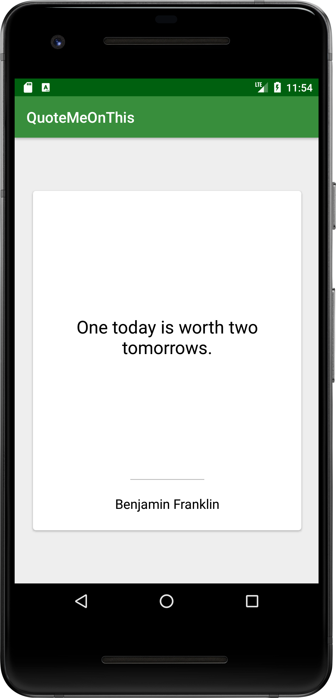

# QuoteMeOnThis
Pagination done with the android paging library

Testing out the v3 android paging library, which makes use of coroutines to load data automatically as needed

# Summary
This is just a basic project for future reference, which makes use of the paging library to load some quotes into card views

# How it's done

The app makes use of the paging library to retrieve data from an api, which then gets populated into a horizontal recyclerview. 

- Retrofit - For retrieving data from the api 
- Koin - For managing dependency 
- Coroutines - For threading
- Paging - For loading content as it's required, by requesting new pages from the API
...and a few more

# How would you run this ? 

You can simply clone this from github and open the project using android studio (the `master` branch is usually where the latest stable build can be found, `dev` is where I work on new features)  there shouldn't be any additional requirements or configurations needed.

# Attribution
[QuoteGarden](https://github.com/pprathameshmore/QuoteGarden) for their api
